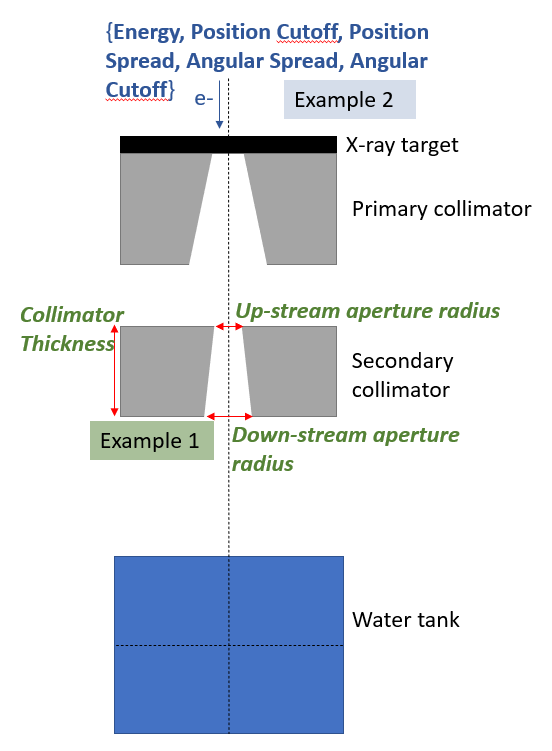
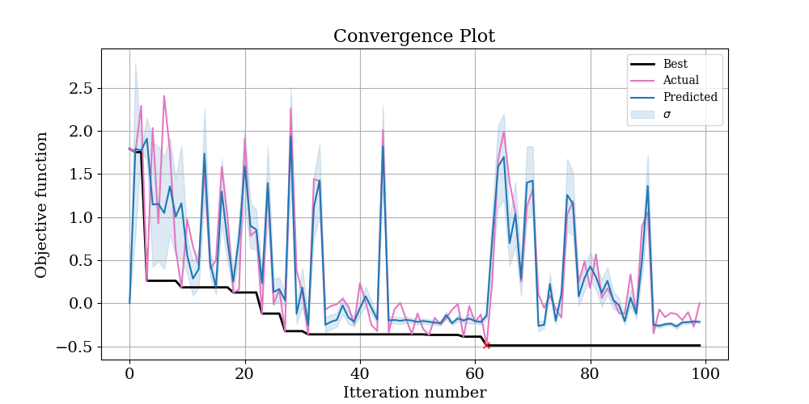
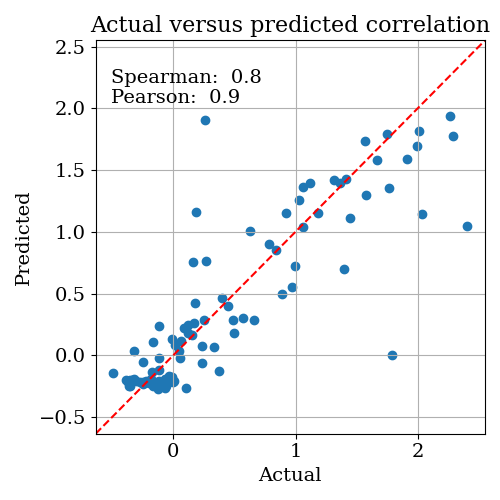
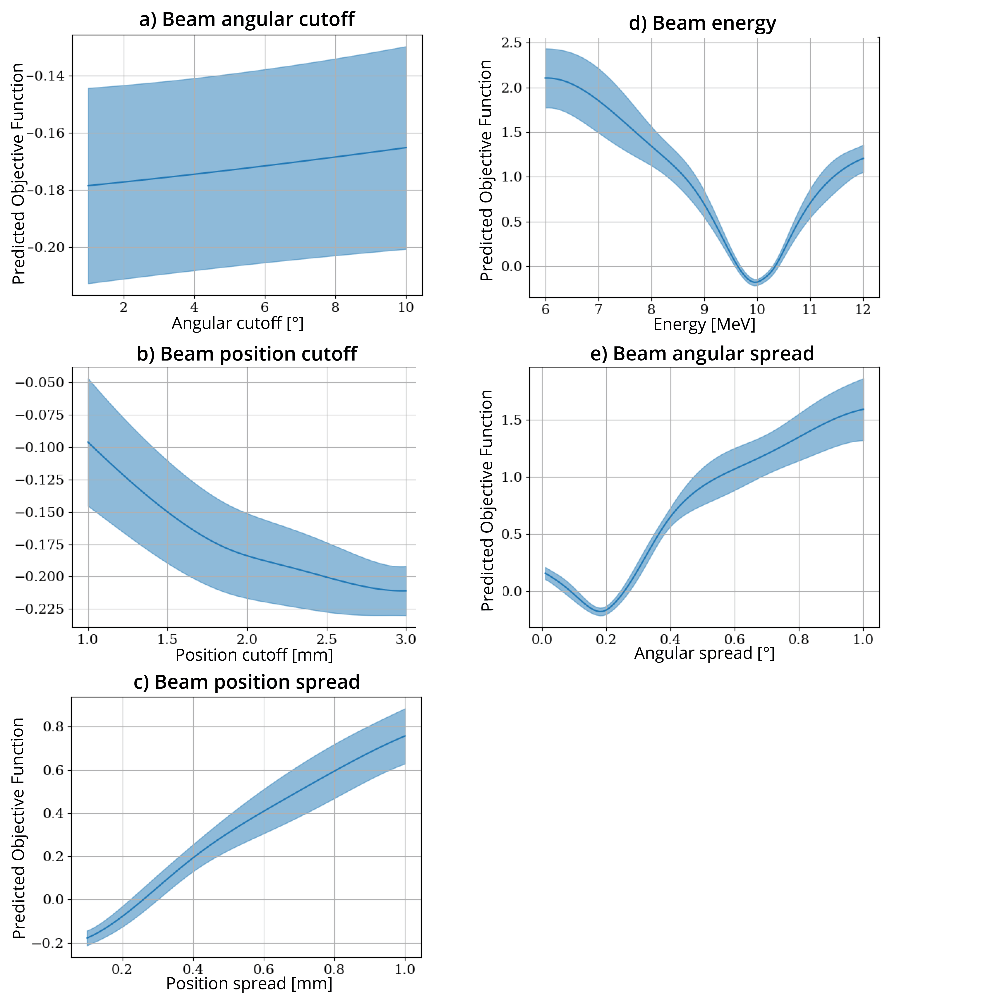
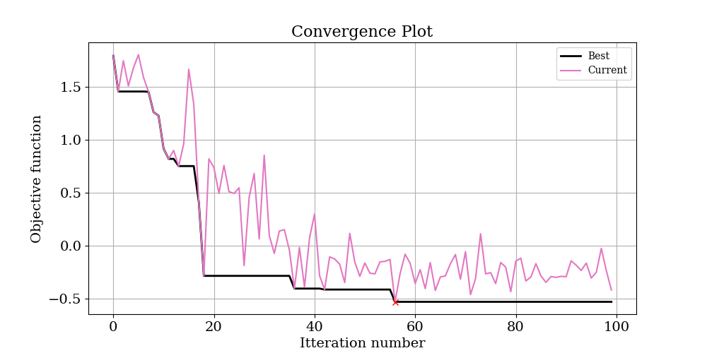

# Phase space optmisation example

> **Note:** in this example it is assumed you have already completed the [example on Geometry optimisation](https://acrf-image-x-institute.github.io/TopasOpt/ApertureOptimisation.html).

In this example, we are going to optimise the same model as in the [ApertureOptimisation example](https://acrf-image-x-institute.github.io/TopasOpt/ApertureOptimisation.html), but instead of optimising geometric parameters, we are going to optimize phase space parameters, shown in blue:



This is a much more difficult problem for several reasons:

- We will optimise five parameters simultaneously instead of three. 
- X-ray dose is actually pretty insensitive to the starting parameters of the electron beam used to produce it. 

## Directory set up

Since we are now running a new optimisation, you have to create a new base directory (you will repeat these basic steps every time you have an optimisation problem). So, create a new directory called e.g. PhaseSpaceOptimisation. The basic setup is the same as the ApertureOptimisation example - you can start by copying accross the SimpleCollimatorExample_TopasFiles directory

## Creating GenerateTopasScript.py

This step is the same as in the geometry example; you should create your base line topas script as described in that example

## Creating RunOptimisation.py

The following is the script to run this optimisation. Remember to change the BaseDirectory to a place that exists on your computer!

```python
import sys
import os
import numpy as np
from pathlib import Path

from TopasOpt import Optimisers as to

BaseDirectory = os.path.expanduser("~") + '/Documents/temp'
SimulationName = 'PhaseSpaceOptimisationTutorial_bayes'
OptimisationDirectory = Path(__file__).parent.resolve()

# set up optimisation params:
optimisation_params = {}
optimisation_params['ParameterNames'] = ['BeamEnergy', 'BeamPositionCutoff', 'BeamPositionSpread', 'BeamAngularSpread',
                                         'BeamAngularCutoff']
optimisation_params['UpperBounds'] = np.array([12, 3, 1, 1, 10])
optimisation_params['LowerBounds'] = np.array([6, 1, 0.1, .01, 1])
# generate a random starting point between our bounds (it doesn't have to be random, this is just for demonstration purposes)
random_start_point = np.random.default_rng().uniform(optimisation_params['LowerBounds'],
                                                     optimisation_params['UpperBounds'])
optimisation_params['start_point'] = np.array([7.85, 2.71, 0.98, 0.1, 2.7])
optimisation_params['Nitterations'] = 100
# optimisation_params['Suggestions'] # you can suggest points to test if you want - we won't here.
ReadMeText = 'This is a public service announcement, this is only a test'

Optimiser = to.BayesianOptimiser(optimisation_params, BaseDirectory, SimulationName, OptimisationDirectory,
                                 TopasLocation='~/topas37', ReadMeText=ReadMeText, Overwrite=True)
Optimiser.RunOptimisation()

```

## Editing GenerateTopasScript.py

Just like last time, we have to edit our baseline script with the parameters that we want to optimise.

In order to reduce the total number of parameters we need to tune, we are going to make the assumption that our source is symmetric in x and y. Make the following changes to GenerateTopasScript.py:

```python
# change
SimpleCollimator.append('dc:So/Beam/BeamEnergy               = 10.0 MeV')
SimpleCollimator.append('dc:So/Beam/BeamPositionCutoffX = 2 mm')
SimpleCollimator.append('dc:So/Beam/BeamPositionCutoffY = 2 mm')
SimpleCollimator.append('dc:So/Beam/BeamPositionSpreadX = 0.3 mm')
SimpleCollimator.append('dc:So/Beam/BeamPositionSpreadY = 0.3 mm')
SimpleCollimator.append('dc:So/Beam/BeamAngularCutoffX = 5 deg')
SimpleCollimator.append('dc:So/Beam/BeamAngularCutoffY = 5 deg')
SimpleCollimator.append('dc:So/Beam/BeamAngularSpreadX = 0.07 deg')
SimpleCollimator.append('dc:So/Beam/BeamAngularSpreadY = 0.07 deg')
SimpleCollimator.append('ic:So/Beam/NumberOfHistoriesInRun = 500000')
# to
SimpleCollimator.append('dc:So/Beam/BeamEnergy               = ' + str(variable_dict['BeamEnergy']) + ' MeV')
SimpleCollimator.append('dc:So/Beam/BeamPositionCutoffX = ' + str(variable_dict['BeamPositionCutoff']) + ' mm')
SimpleCollimator.append('dc:So/Beam/BeamPositionCutoffY = ' + str(variable_dict['BeamPositionCutoff']) + ' mm')
SimpleCollimator.append('dc:So/Beam/BeamPositionSpreadX = ' + str(variable_dict['BeamPositionSpread']) + ' mm')
SimpleCollimator.append('dc:So/Beam/BeamPositionSpreadY = ' + str(variable_dict['BeamPositionSpread']) + ' mm')
SimpleCollimator.append('dc:So/Beam/BeamAngularCutoffX = ' + str(variable_dict['BeamAngularCutoff']) + ' deg')
SimpleCollimator.append('dc:So/Beam/BeamAngularCutoffY = ' + str(variable_dict['BeamAngularCutoff']) + ' deg')
SimpleCollimator.append('dc:So/Beam/BeamAngularSpreadX = ' + str(variable_dict['BeamAngularSpread']) + ' deg')
SimpleCollimator.append('dc:So/Beam/BeamAngularSpreadY = ' + str(variable_dict['BeamAngularSpread']) + ' deg')
SimpleCollimator.append('ic:So/Beam/NumberOfHistoriesInRun = 200000') # note we run more particles in this example because we are more sensitive to noise
```

## Create TopasObjectiveFunction.py

We need to create an objective function. Since our basic problem is the same in the Aperture Optimisation example, we are using a very similar objective function. However, because we expect the results aren't especially sensitive to the parameters we are optimising, we know we will be looking for small differences. Therefore, we could take the log of the objective function to emphasize the difference between small changes. For explanation about why we choose to take the log see [here](https://acrf-image-x-institute.github.io/TopasOpt/designing_objective_functions.html).

Note that there's a lot of things we could do to make this objective function better  - especially in light of the NelderMead results from the first example! But for now I am just keeping these examples very simple. 

```python
import os
from TopasOpt.utilities import WaterTankData
import numpy as np
from pathlib import Path

def CalculateObjectiveFunction(TopasResults, GroundTruthResults):
    """
    In this example, for metrics I am going to calculate the RMS error between the desired and actual
    profile and PDD. I will use normalised values to account for the fact that there may be different numbers of
    particles used between the different simulations
    """

    # define the points we want to collect our profile at:
    Xpts = np.linspace(GroundTruthResults.x.min(), GroundTruthResults.x.max(), 100)  # profile over entire X range
    Ypts = np.zeros(Xpts.shape)
    Zpts = GroundTruthResults.PhantomSizeZ * np.ones(Xpts.shape)  # at the middle of the water tank

    OriginalProfile = GroundTruthResults.ExtractDataFromDoseCube(Xpts, Ypts, Zpts)
    OriginalProfileNorm = OriginalProfile * 100 / OriginalProfile.max()
    CurrentProfile = TopasResults.ExtractDataFromDoseCube(Xpts, Ypts, Zpts)
    CurrentProfileNorm = CurrentProfile * 100 / CurrentProfile.max()
    ProfileDifference = OriginalProfileNorm - CurrentProfileNorm

    # define the points we want to collect our DD at:
    Zpts = GroundTruthResults.z
    Xpts = np.zeros(Zpts.shape)
    Ypts = np.zeros(Zpts.shape)

    OriginalDepthDose = GroundTruthResults.ExtractDataFromDoseCube(Xpts, Ypts, Zpts)
    CurrentDepthDose = TopasResults.ExtractDataFromDoseCube(Xpts, Ypts, Zpts)
    OriginalDepthDoseNorm = OriginalDepthDose * 100 /np.max(OriginalDepthDose)
    CurrentDepthDoseNorm = CurrentDepthDose * 100 / np.max(CurrentDepthDose)
    DepthDoseDifference = OriginalDepthDoseNorm - CurrentDepthDoseNorm

    ObjectiveFunction = np.mean(abs(ProfileDifference)) + np.mean(abs(DepthDoseDifference))
    return np.log(ObjectiveFunction)  # only difference from the geometry optimisation is that we will take the log here!


def TopasObjectiveFunction(ResultsLocation, iteration):
    ResultsFile = ResultsLocation / f'WaterTank_itt_{iteration}.bin'
    path, file = os.path.split(ResultsFile)
    CurrentResults = WaterTankData(path, file)

    GroundTruthDataPath = str(Path(__file__).parent / 'SimpleCollimatorExample_TopasFiles' / 'Results')
    # this assumes that you stored the base files in the same directory as this file, updated if needed
    GroundTruthDataFile = 'WaterTank.bin'
    GroundTruthResults = WaterTankData(GroundTruthDataPath, GroundTruthDataFile)

    OF = CalculateObjectiveFunction(CurrentResults, GroundTruthResults)
    return OF
```

## Running the example

Note that there are many other beam parameters we could choose to include. 
We are going to keep this relatively simple by just having four optimization parameters

## Analyzing the results





Next, open up OptimisationLogs.txt, and scroll to the end; the best found solution is recorded:

```
Best parameter set: {'target': -0.5824966507848057, 'params': {'BeamAngularCutoff': 8.093521167768209, 'BeamAngularSpread': 0.01, 'BeamEnergy': 9.606637841613118, 'BeamPositionCutoff': 2.265724252124363, 'BeamPositionSpread': 0.309694887480956}}
```

These values are copied into the below table along with the ground truth values and the range we allowed them to vary over:

| Parameter          | Ground Truth | Allowed Range | Optimized    |
| ------------------ | ------------ | ------------- | ------------ |
| BeamEnergy         | 10           | 6-12          | 9.98 (0.2%%) |
| BeamPositionCutoff | 2            | 1-3           | 1.88 (6%)    |
| BeamPositionSpread | 0.3          | .1-1          | .1 (66%)     |
| BeamAngularSpread  | .07          | .01-1         | .19 (171%)   |
| BeamAngularCutoff  | 5            | 1-10          | 1.0 (80%)    |

We have obtained very close matches to BeamEnergy and BeamPositionCutoff. For the other parameters, we are quite a long way off in percentage terms - although, in absolute terms we are still often pretty close, it's just because many of these parameters have very small starting values that the percentages look so bad.

An interesting question is - "well, which of these parameters is actually likely to be important in out objective function." You can address this by looking at the plots in logs/SingleParameterPlots:

> **warning:** these plots show the value of the objective function predicted by the model. In the instances where the correlation between the predicted and actual objective functions is high, you can trust that these plots at least correlate with reality. But if the correlation is low, these plots are essentially nonsense.



These plots show the predicted change in the objective function as each single parameter is varied and all other parameters are held at their optimal value. From these plots, we can see that the most sensitive parameters seem to be BeamEnergy, BeamPositionSpread, and BeamAngularSpread. 

## NelderMead Optimiser

Below is the convergence plot and results for the same problem solved with the Nelder Mead optimiser:



| Parameter          | Ground Truth | Allowed Range | Optimized |
| ------------------ | ------------ | ------------- | --------- |
| BeamEnergy         | 10           | 6-12          | 7.8       |
| BeamPositionCutoff | 2            | 1-3           | 2.7       |
| BeamPositionSpread | 0.3          | .1-1          | 1.0       |
| BeamAngularSpread  | .07          | .01-1         | 0.1       |
| BeamAngularCutoff  | 5            | 1-10          | 2.7       |

Like we have seen in our [previous example](https://acrf-image-x-institute.github.io/TopasOpt/ApertureOptimisation.html), the Nelder-Mead optimiser is completely outperformed by the Bayesian Optimiser. Nelder-Mead initially converges very quickly, but then is essentially 'stuck' in a set of parameters. 

## Comparing the results:

Maybe you want to take a look at how a given iteration has performed versus the ground truth data. We have a handy function that allows you to quickly produce simple plots comparing different results:

```python
from TopasOpt.utilities import compare_multiple_results

# update paths to point to wherever your results are.
ResultsToCompare = ['SimpleCollimatorExample_TopasFiles/Results/WaterTank.bin',
                    'C:/Users/Brendan/Dropbox (Sydney Uni)/Projects/PhaserSims/topas/PhaseSpaceOptimisationTest/Results/WaterTank_itt_0.bin',
                    'C:/Users/Brendan/Dropbox (Sydney Uni)/Projects/PhaserSims/topas/PhaseSpaceOptimisationTest/Results/WaterTank_itt_95.bin',
                    'C:/Users/Brendan/Dropbox (Sydney Uni)/Projects/PhaserSims/topas/PhaseSpaceOptimisationTest_NM/Results/WaterTank_itt_65.bin']

custom_legend = ['Original', 'RandomStartPoint', 'Bayesian', 'NelderMead']
compare_multiple_results(ResultsToCompare, custom_legend_names=custom_legend)

```

Comparing our best result with the ground truth yields the below plot:


- although our Bayesian optimization didn't recover the exact parameters, the parameters it did select give a very good match to the ground truth
- The NM did not do so well, getting stuck in a local minimum again.
- We are in the realm where the noise in the data probably prevents us from finding a better match. If we really wanted to get a better estimate of these parameters, we probably have to run  a lot more particles. 
